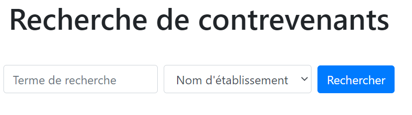
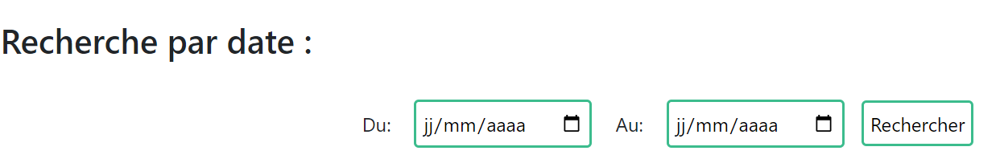
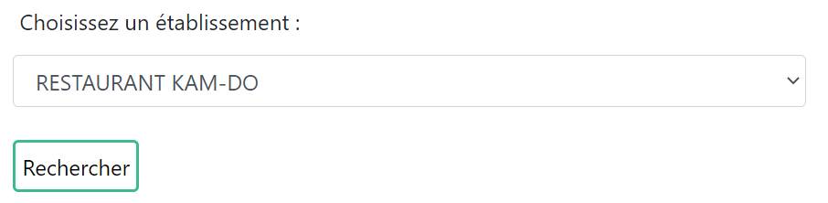
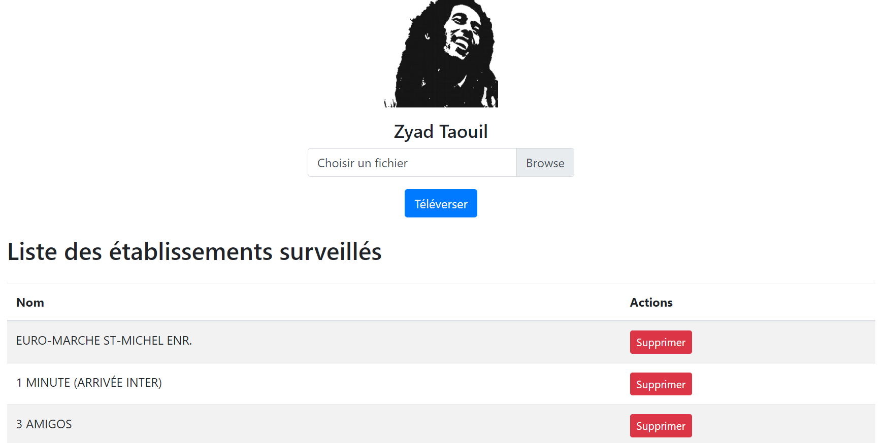

### A1
Pour tester cette fonctionnalité : lancer dans main.py get_db().update_data()

### A2
L'onglet 'Accueil' à la route '/' possède cette fonctionnalité, il suffit de rentrer le terme de recherche dans l'input dédié et séléctionner dans la liste déroulante le type de recherche:

### A3
La fonctionnalité du background scheduler se situe à la ligne : 182

### A4
Pour tester cette fonctionnalité : il suffit de rajouter au nom de domaine cette ligne : /contrevenants?du=2020-05-08&au=2022-05-15
La documentation RAML se trouve sur la route /doc

### A5
L'onglet 'Accueil' à la route '/' possède cette fonctionnalité, il suffit de saisir les dates de début et de fin dans les champs dédiés et appuyer sur le bouton 'rechercher':

### A6
Fonctionnalité disponible dans l'onglet 'établissements' à la route '/etablissements'. Il suffit de séléctionner l'établissement et appuyer sur le bouton 'rechercher' :

### B1
La fonctionnalité est testée à la ligne 184 avec le backgroundscheduler qui lance chaque jour la fonction 'check_for_new_etablissements' puisque les importations de données se font seulement par le backgroundscheduler. Le fichier config.yaml contient l'adresse du destinataire du courriel.

### C1
Pour tester cette fonctionnalité : il faut ajouter au nom de domaine la ligne suivante : /api/violations/etablissements_json
La documentation RAML se trouve sur la route /doc

### C2
Pour tester cette fonctionnalité : il faut ajouter au nom de domaine la ligne suivante : /api/violations/etablissements_xml
La documentation RAML se trouve sur la route /doc

### C3
Pour tester cette fonctionnalité : il faut ajouter au nom de domaine la ligne suivante : /api/violations/etablissements_csv
La documentation RAML se trouve sur la route /doc

### E1
Cette fonctionnalité est réellement testée dans le point E2 avec la route /inscription. 
La route associée à cette fonctionnalité est : /api/utilisateurs

### E2
Cette fonctionnalité est testée dans la route /inscription, /login et /profil:
Pour tester la fonctionnalité de téléversement de photo est disponible dans /profil une fois l'utilisateur inscris ou authentifié. 
La liste des établissements surveillés est également disponible dans la route /profil :

### E3
Cette fonctionnalité est testée avec la ligne 187 car on vérifie si il y a de nouveaux établissements à chaque importation de données et on notifie l'utilisateur si c'est bien le cas.